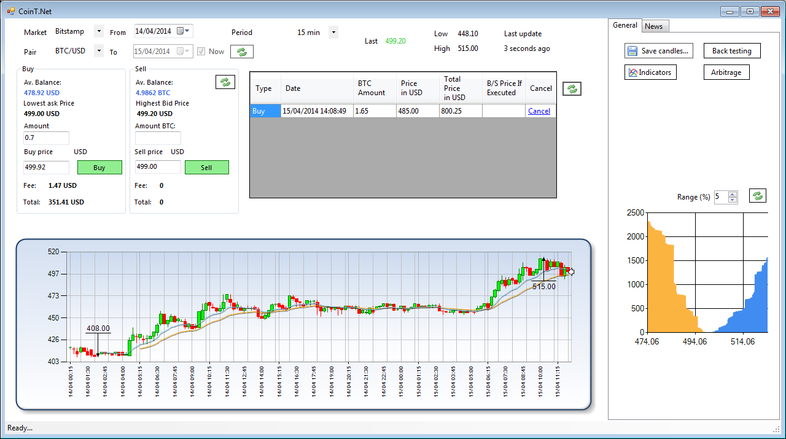

CoinT.Net
============

### Introduction

CoinT.Net is a basic trading application for bitcoins and other altcoins, which enables users to:
- visualise ticker/candles from exchanges (Bitstamp, BTC-e and Cryptsy for now), with basic indicators (MA, EMA)
- send buy/sell orders to these exchanges for multiple currencies
- visualise the order book
- back test trading strategies (EMA crossing and MACD for now)
- Retrieve news items from RSS feeds and Twitter

There is also a feature to check on arbitrage opportunities within BTC-e's multiple currencies (but it's just paper trading for now)

Note: historic trading data is retrieved from Bitcoincharts.com for BTC and Bitcoinwisdom.com for other currencies. Consequently, not all data might be available.

This application was mainly inspired by this project:

[codingdna2/easybot](https://github.com/codingdna2/easybot)

### Source Code

CoinT.Net is a Winforms application, developed in C# and Visual Studio 2013 Express (.Net 4.5). The following external libraries are used

[migrap/BitcoinCharts](https://github.com/migrap/BitcoinCharts)

[DmT021/BtceApi](https://github.com/DmT021/BtceApi)

### Technical notes

It should not be too hard to add more exchanges, then just need to implement the IExchange interface

The currency pairs that can be traded on BTC-e are hard-coded for now, but it's easy to add more

### TODO List

- Add more exchanges and currencies
- Add real time bot trading (it's pretty much finished, but has not been tested)
- Add more indicators
- Add more trading strategies
- Use streaming APIs when available

### Installation

If you are a developper, you can just use Visual Studio 2013 Express to open the solution and recompile the application. 
Otherwise, just extract the [CointT.Net-Release.zip](https://github.com/wishhhmaster/CoinTNet/raw/master/CointT.Net-Release.zip) file

### Configuration

The API keys can be configured from the Options screen. They will be saved in an encrypted format on yor computer. API keys are:

- Bitstamp's API parameters (needed if you want to send orders)
- BTC-e API's parameters (needed if you want to send orders)
- Cryptsy API's parameters (needed if you want to send orders)
- Twitter's parameters (needed if you want to retrieve Tweets)

### Warnings

- The source code is provided as-is. There might be some bugs, so advise you to review the code before using it, especially before making trade orders.
- Historic data is retrieved from bitcoincharts.com and/or bitcoinwidsom.com, and consequently might not be available (if these websites are down, or if they do not store data for the selected currency pairs, as it is the case with most of Cryptsy's pairs). 
Most recent data is retrieved directly from the exchanges' APIs, but is often limited to the last few hundred trades (which can span hours or days)
- The high/low prices for the last 24 hours are not available from Cryptsy's API

### Donations

If you find this tool useful, you can show you support with a kind donation:

BTC: 1JctmffLPQtcmTSBEDCDquGDeMprfqxX1k

LTC: LXSogLKon4WHWzJvZouPpDYojkAHASixve
